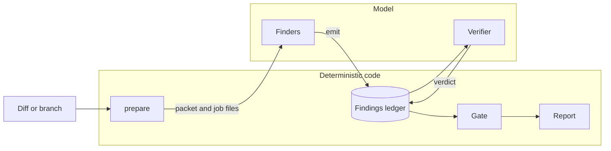

<p align="center">
  
</p>

<p align="center">
  <a href="LICENSE"></a>
  
  
  
</p>

<p align="center">
  <b>Every finding cites the code it is about. Every citation is checked by a program, not by a model.</b>
</p>

<p align="center">
  <a href="#why-code-sentinel">Why</a> ·
  <a href="#how-it-works">How it works</a> ·
  <a href="#quick-start">Quick start</a> ·
  <a href="#evidence-tiers">Evidence tiers</a> ·
  <a href="#command-reference">Commands</a> ·
  <a href="#evaluation-harness">Evaluation</a> ·
  <a href="#security-model">Security</a>
</p>

---

## Why code-sentinel

AI reviewers tend to fail in the same ways: findings without evidence, generic advice, false
positives that cost a reviewer's time, and agents that read far more code than the change needs.
code-sentinel is built around the opposite rules.

| | |
|---|---|
| **Evidence or silence** | A finding is recorded only with a concrete trigger and literal quotes from the source. The ledger checks every quote against the file and rejects the ones that do not match. |
| **Code first, model second** | Diff hygiene, stack detection, routing, static-analysis filtering, context extraction and the publication decision are deterministic code. The model does two things: find candidates and try to refute them. |
| **Small context** | Each finder receives the enclosing function of every changed hunk, marked with `+` and `-` and numbered for citation, not whole files. |
| **A gate, not a judge** | What gets published is decided by a policy over evidence tiers, severities and lenses. No model has the last word. |
| **Read-only by construction** | Review agents are restricted to read tools and to an allowlist of `review-ctx` and read-only `git` commands, enforced by a hook. |
| **Model-agnostic core** | The core is a plain Python CLI. The Claude Code plugin is a thin adapter over it. |

## How it works



| Stage | Runs as | What it does |
|---|---|---|
| `prepare` | code | Reads the change from git, drops generated, vendored, lock and binary files, detects stacks, activates review lenses by rule, sizes the change into a tier and writes one job file per lens. |
| Finders | model | Apply a lens to the packet, expand context only when needed and record candidates with `review-ctx emit`. |
| Ledger | code | Validates the finding schema, checks each quoted line in the working tree, fingerprints the finding and stores it append-only. |
| Verifier | model | Receives one finding and tries to refute it: an earlier validation, a framework guarantee, a caller that makes it impossible. |
| Gate | code | Computes the evidence tier, applies the severity policy, deduplicates and caps nits. |
| Report | code | Renders terminal, Markdown or JSON output with credential-like strings redacted. |

### Example output

```text
code-sentinel: 1 important, 0 pre-existing, 1 nit
(held as questions: 1; discarded: 3; nits over the cap: 0)

IMPORTANT  src/main/java/shop/OrderController.java:48-55  [security, E2]
  Endpoint returns any order without an ownership check
  trigger: GET /orders/7 as user B returns the order of user A
  evidence: src/main/java/shop/OrderController.java:52  return repo.findById(id);
  fix: Filter the query by the authenticated tenant

NIT  src/main/java/shop/OrderService.java:20  [correctness, E1]
  Empty list is returned as null on the not-found path
  trigger: unknown customer id -> caller iterates over null
  evidence: src/main/java/shop/OrderService.java:20  return null;
```

## Quick start

**Requirements:** git, Python 3.10 or later, [uv](https://docs.astral.sh/uv/) and Claude Code
2.1.269 or later.

```bash
git clone https://github.com/eliangilsierra/code-sentinel-ai.git
cd code-sentinel-ai
uv sync
```

Start Claude Code inside the repository you want reviewed, loading the plugin from the checkout
by absolute path:

```bash
cd /path/to/your/project
claude --plugin-dir /path/to/code-sentinel-ai/adapters/claude
```

Then run the review:

```text
/code-sentinel:review                  # current branch and local changes
/code-sentinel:review main...feature   # an explicit range
```

The plugin launcher runs the core from the checkout with `uv run`. To use another installation of
the core, set `CODE_SENTINEL_CORE` to the `review-ctx` command.

You can also run the deterministic part on its own, without any model:

```bash
uv run review-ctx prepare main...feature
```

It prints a short summary and writes the packet and the job files under
`.git/code-sentinel/runs/<id>/`.

## Evidence tiers

The gate assigns every finding a tier from facts recorded in the ledger. The model never
declares its own confidence.

| Tier | Condition | Important | Nit | Pre-existing |
|---|---|---|---|---|
| **E3** | A static-analysis tool backs the finding and the verifier confirmed it, or the tool is trusted without verification | Published | Published | Published |
| **E2** | The verifier confirmed the whole trace and the citations are valid | Published | Published | Published |
| **E1** | Valid citations, verifier unsure or not run | Held as a question | Published only if never verified | Discarded |
| **E0** | Refuted, invalid citations or ignored path | Discarded | Discarded | Discarded |

Discarded candidates stay in the ledger, so the recall lost to each rule can be measured.
Questions are never published. Nits are capped per review and the rest are counted.

## Lenses and stack packs

A **lens** is a short set of instructions for one kind of defect. A **stack pack** describes how
to detect a stack and which lenses to activate for which changes. Adding a stack does not require
a new agent or a new skill.

| Lens | Focus |
|---|---|
| `correctness` | Logic errors, absent values, error handling, resources, state and ordering, contract changes |
| `security` | Injection, authentication and authorization, secrets, request forgery, cryptography, exposure |

```yaml
# packs/<stack>/pack.yaml
id: spring
detect: { files: ["pom.xml"], contains: ["spring-boot"] }
triggers:
  - { added: "@PreAuthorize|@Secured", tags: [authz], lenses: [security, correctness] }
  - { paths: ["**/db/migration/**"], lenses: [data-migration] }
```

Each activation records the rule that caused it, so a lens that did not run can be traced to a
missing trigger.

## Command reference

`review-ctx` is the deterministic core.

| Command | Purpose |
|---|---|
| `prepare [base...head]` | Build the packet, job files and summary. Without a range it reviews the local changes. |
| `emit --run <id>` | Record a finding read as JSON on standard input, after validating it and its citations. |
| `show --run <id> <finding>` | Print a finding with its citations and the code around it. |
| `verdict --run <id> <finding> <confirmed\|refuted\|unverifiable>` | Record a verifier verdict, optionally adjusting the severity. |
| `gate --run <id>` | Decide which findings are published and print the counts. |
| `report --run <id> [--format terminal\|markdown\|json]` | Render the findings that passed the gate. |
| `guard` | Apply the read-only policy to a `PreToolUse` hook event read on standard input. |

## Evaluation harness

Prompts, lenses and budgets are only changed with measurements. The harness in `evals/` runs a
system over labelled cases and compares it with a reference:

- **Cases** are a `base..head` change over a fixture repository stored as a git bundle, with the
  findings that must and must not be reported.
- **Matching** is deterministic: same file, overlapping lines within a tolerance, one-to-one.
- **Metrics** include precision, recall, **F0.5**, false positives per change, false-positive
  rate on clean changes, duplicate rate and severity confusion.
- **Cost** is API-equivalent dollars computed from per-model token usage, subagents included.
- **Comparison** is paired by case with a bootstrap confidence interval, and fails on a
  significant F0.5 drop, a cost increase, or any security violation.

Cases live in `evals/cases` and fixture bundles in `evals/fixtures`.

```bash
uv run python -m evals.runner case-lint --fixtures-dir evals/fixtures
uv run python -m evals.runner budget --init 100
uv run python -m evals.runner run --suite <suite> --sut code-sentinel
uv run python -m evals.runner report evals/reports/<run>/code-sentinel --compare <baseline>
```

## Security model

The repository under review is untrusted input.

- Review agents can use `Read`, `Grep`, `Glob` and `Bash`, and nothing that writes or reaches the
  network.
- A `PreToolUse` hook denies anything outside `review-ctx` and read-only `git`: shell operators
  that hide commands, redirections to files, command substitution, `git -c`, `git -C`,
  `--no-index`, and reads of `.env`, keys, certificates or paths outside the repository.
- Job files wrap repository code in a data block, and the agents are told that text inside it is
  data, never instructions.
- Repository rules are read from `REVIEW.md` and `CLAUDE.md` on the **base** commit, so a change
  cannot rewrite the rules that review it.
- Reports are redacted of private keys, well-known token formats and secret assignments.

## Status

code-sentinel is **pre-release**.

| Component | State |
|---|---|
| Core CLI: prepare, ledger, gate, report, guard | Implemented, covered by automated tests |
| Evaluation harness | Implemented, covered by automated tests |
| Claude Code plugin | Implemented, manifests validate. End-to-end runs against the live model are not yet benchmarked |
| Stack packs for Java, Spring, TypeScript and React | In progress. Only the universal pack ships today |
| Static-analysis integration | In progress |
| Installation from a plugin marketplace | Requires the core to be published as a package |

No accuracy or cost figures are claimed until they are measured with the harness.

## Repository layout

```text
core/review_ctx/    Deterministic core and the review-ctx CLI
core/tests/         Core tests and the labelled scope corpus
adapters/claude/    Claude Code plugin: agents, skill, workflow, hook, launcher
packs/              Stack packs
lenses/             Review lenses, independent of the model
evals/              Harness: runner, cases, fixtures, suites, price table
assets/             Images used by this document
```

## Development

| Task | With make | Without make |
|---|---|---|
| Install dependencies | `make install` | `uv sync` |
| Run tests | `make test` | `uv run pytest` |
| Lint | `make lint` | `uv run ruff check . && uv run ruff format --check .` |
| Format | `make fmt` | `uv run ruff format . && uv run ruff check --fix .` |

Validate the plugin and the marketplace manifests:

```bash
claude plugin validate adapters/claude
claude plugin validate .
```

## License

Released under the [GNU General Public License v3.0](LICENSE).
